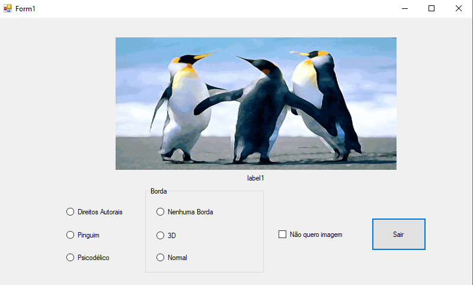
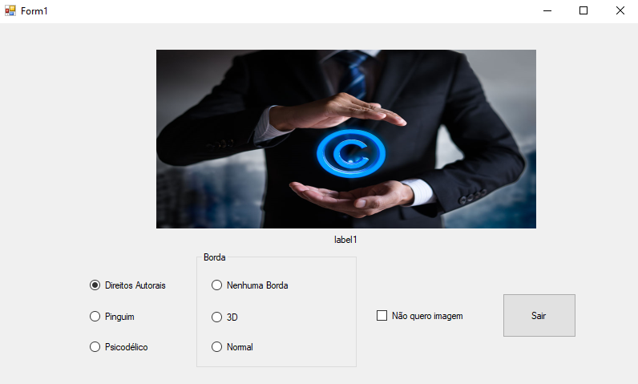
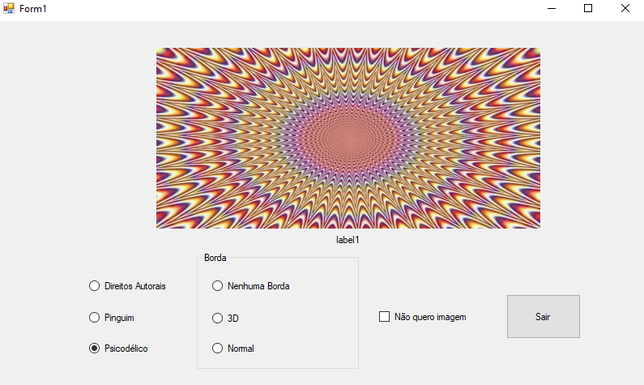
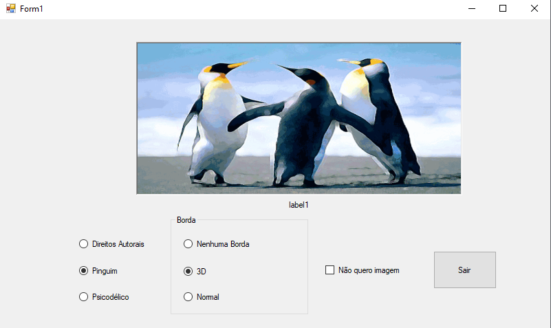
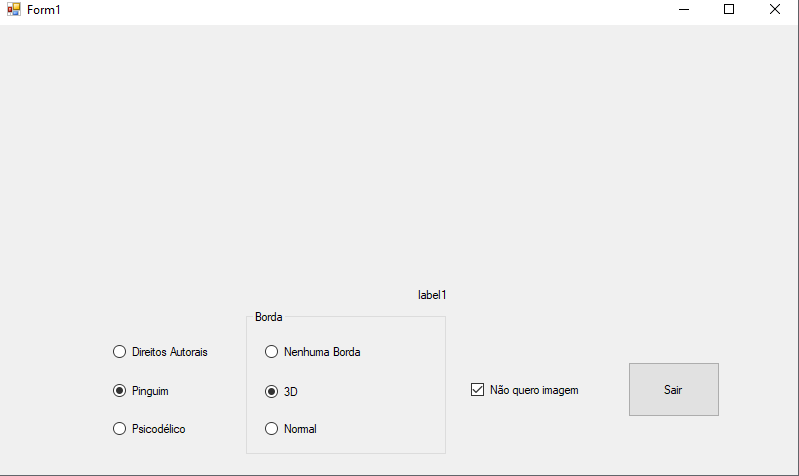
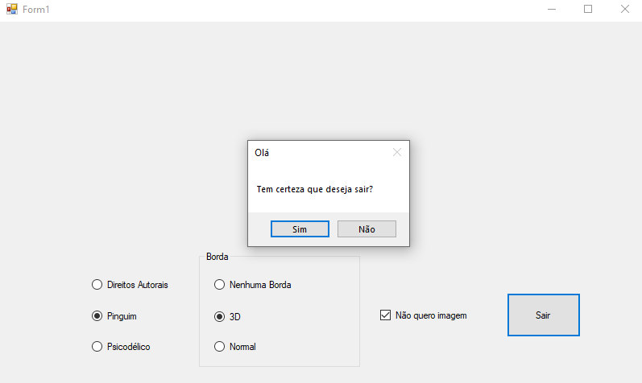

# aulaPictureBoxCSharp
aprendendo e testando o picture box na aula de C# na Etec de Guarulhos.
  

  <h3>Tela inicial com a imagem dos pinguins</h3>
  

 

  <h3>Botão que faz trocar de imagem</h3>
   

 

  <h3>Botões que fazem trocar o tipo de borda</h3>
  

 

  <h3>Botão que faz escconder a imagem</h3>
  

 

  <h3>Botão para sair</h3>
  

